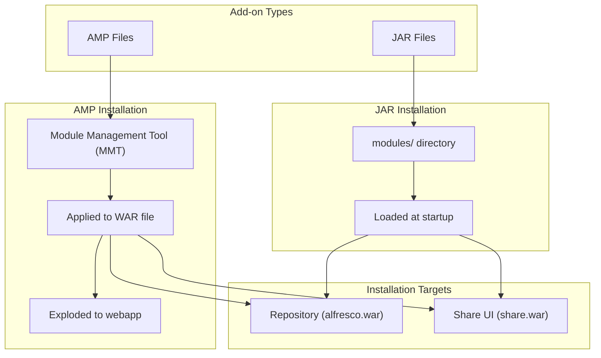

# Installing Add-ons in Alfresco

This guide explains how to install add-ons (extensions) in your Alfresco installation using the `15-install_addons.sh` script.

## Table of Contents

* [Overview](#overview)
* [Add-on Types](#add-on-types)
* [Prerequisites](#prerequisites)
* [Installing Add-ons](#installing-add-ons)
  * [Example 1: AMP Add-on (OOTBee Support Tools)](#example-1-amp-add-on-ootbee-support-tools)
  * [Example 2: JAR Add-on (Script Root Object)](#example-2-jar-add-on-script-root-object)
* [Managing Add-ons](#managing-add-ons)

---

## Overview

Alfresco supports two types of add-ons:



## Add-on Types

| Type | Extension | Installation Method | Use Case |
|------|-----------|---------------------|----------|
| **AMP** | `.amp` | Module Management Tool (MMT) | Full-featured modules with web resources, Spring contexts, overlays |
| **JAR** | `.jar` | Copy to modules directory | Simple extensions (scripts, behaviors, webscripts) |

### AMP (Alfresco Module Package)

AMPs are the traditional packaging format for Alfresco extensions:

- Applied to WAR files using the Alfresco Module Management Tool (MMT)
- Can modify `web.xml`, add Spring configurations, include web resources
- Stored in `${ALFRESCO_HOME}/amps` (platform) or `${ALFRESCO_HOME}/amps_share` (Share)
- **Examples**: OOTBee Support Tools, Alfresco Share Services

### JAR (Simple Module)

JARs are lightweight extensions:

- Placed directly in the modules directory
- Loaded automatically at Tomcat startup
- No WAR modification required
- Stored in `${ALFRESCO_HOME}/modules/platform` or `${ALFRESCO_HOME}/modules/share`
- **Examples**: Custom behaviors, web scripts, utility libraries

## Prerequisites

Before installing add-ons:

1. **Alfresco must be installed** - Run scripts `01` through `06` first
2. **Stop Alfresco services** - Add-ons should be installed with services stopped
3. **Verify add-on compatibility** - Check the add-on supports your Alfresco version

```bash
# Stop services before installing add-ons
bash scripts/12-stop_services.sh
```

## Installing Add-ons

### Example 1: AMP Add-on (OOTBee Support Tools)

[OOTBee Support Tools](https://github.com/OrderOfTheBee/ootbee-support-tools) provides administrative and support features for Alfresco, including JMX monitoring, log management, JavaScript Console, and system information dashboards.

#### Step 1: Download the Add-on

Download version 1.2.3.0 from Maven Central:

```bash
# Create downloads directory
mkdir -p downloads/addons
cd downloads/addons

# Download Repository AMP (for Alfresco platform)
curl -LO https://repo1.maven.org/maven2/org/orderofthebee/support-tools/support-tools-repo/1.2.3.0/support-tools-repo-1.2.3.0-amp.amp

# Download Share AMP (for Share UI)
curl -LO https://repo1.maven.org/maven2/org/orderofthebee/support-tools/support-tools-share/1.2.3.0/support-tools-share-1.2.3.0-amp.amp

cd ../..
```

> **Note**: Version 1.2.3.0 is compatible with Alfresco 7.x, 23.x, and 25.x. The artifacts are published to [Maven Central](https://central.sonatype.com/search?q=g%3Aorg.orderofthebee.support-tools) in both JAR and AMP formats. Check the [releases page](https://github.com/OrderOfTheBee/ootbee-support-tools/releases) for version details.

#### Step 2: Stop Services

```bash
bash scripts/12-stop_services.sh
```

#### Step 3: Install the Repository AMP

```bash
bash scripts/15-install_addons.sh \
    --amp downloads/addons/support-tools-repo-1.2.3.0-amp.amp \
    --target repo
```

#### Step 4: Install the Share AMP

```bash
bash scripts/15-install_addons.sh \
    --amp downloads/addons/support-tools-share-1.2.3.0-amp.amp \
    --target share
```

#### Step 5: Start Services

```bash
bash scripts/11-start_services.sh
```

#### Step 6: Verify Installation

After Alfresco starts, verify the add-on is installed:

```bash
# List installed modules
bash scripts/15-install_addons.sh --list
```

Access the Support Tools in Share:
- Navigate to: `http://localhost/share/page/console/admin-console/support-tools`
- Or from Share Admin Console → Support Tools

---

### Example 2: JAR Add-on (Script Root Object)

[Alfresco Script Root Object](https://github.com/aborroy/alfresco-script-root-object) provides a custom root object for Alfresco JavaScript API, useful for extending scripting capabilities.

#### Step 1: Download the Add-on

```bash
# Create downloads directory
mkdir -p downloads/addons
cd downloads/addons

# Download JAR
curl -LO https://github.com/aborroy/alfresco-script-root-object/releases/download/2.0.0/alfresco-script-root-object-2.0.0.jar

cd ../..
```

#### Step 2: Stop Services

```bash
bash scripts/12-stop_services.sh
```

#### Step 3: Install the JAR

```bash
bash scripts/15-install_addons.sh \
    --jar downloads/addons/alfresco-script-root-object-2.0.0.jar \
    --target repo
```

#### Step 4: Start Services

```bash
bash scripts/11-start_services.sh
```

#### Step 5: Verify Installation

```bash
# List installed modules
bash scripts/15-install_addons.sh --list
```

The JAR will be visible in the Platform JARs section.

---

## Alternative: Install Directly from URL

The script supports downloading and installing directly from a URL:

```bash
# Install AMP from Maven Central
bash scripts/15-install_addons.sh \
    --url https://repo1.maven.org/maven2/org/orderofthebee/support-tools/support-tools-repo/1.2.3.0/support-tools-repo-1.2.3.0-amp.amp \
    --target repo

# Install JAR from GitHub
bash scripts/15-install_addons.sh \
    --url https://github.com/aborroy/alfresco-script-root-object/releases/download/2.0.0/alfresco-script-root-object-2.0.0.jar \
    --target repo
```

## Managing Add-ons

### List Installed Add-ons

```bash
bash scripts/15-install_addons.sh --list
```

This shows:
- AMPs applied to `alfresco.war` and `share.war`
- AMP files in `amps/` and `amps_share/` directories
- JAR files in `modules/platform/` and `modules/share/`

### Verify Installation

```bash
bash scripts/15-install_addons.sh --verify
```

### Directory Structure

After installing add-ons, your Alfresco installation will have:

```
/opt/alfresco/
├── amps/                          # Platform AMP files
│   └── support-tools-repo-1.2.3.0-amp.amp
├── amps_share/                    # Share AMP files
│   └── support-tools-share-1.2.3.0-amp.amp
├── modules/
│   ├── platform/                  # Platform JAR modules
│   │   └── alfresco-script-root-object-2.0.0.jar
│   └── share/                     # Share JAR modules
└── tomcat/
    └── webapps/
        ├── alfresco/              # Exploded platform WAR (with AMPs applied)
        └── share/                 # Exploded Share WAR (with AMPs applied)
```

### Quick Reference

| Action | Command |
|--------|---------|
| Install platform AMP | `bash scripts/15-install_addons.sh --amp <file.amp> --target repo` |
| Install Share AMP | `bash scripts/15-install_addons.sh --amp <file.amp> --target share` |
| Install platform JAR | `bash scripts/15-install_addons.sh --jar <file.jar> --target repo` |
| Install Share JAR | `bash scripts/15-install_addons.sh --jar <file.jar> --target share` |
| Install from URL | `bash scripts/15-install_addons.sh --url <url> --target <repo\|share>` |
| List all add-ons | `bash scripts/15-install_addons.sh --list` |
| Verify installation | `bash scripts/15-install_addons.sh --verify` |
| Show help | `bash scripts/15-install_addons.sh --help` |

### Removing Add-ons

#### Remove a JAR Module

Simply delete the JAR file and restart:

```bash
sudo rm /opt/alfresco/modules/platform/alfresco-script-root-object-2.0.0.jar
bash scripts/12-stop_services.sh
bash scripts/11-start_services.sh
```

#### Remove an AMP Module

AMP removal is more complex as it modifies WAR files. The safest approach:

1. Delete the exploded webapp directory
2. Remove the AMP from the amps directory
3. Re-apply remaining AMPs
4. Restart services

```bash
# Stop services
bash scripts/12-stop_services.sh

# Remove exploded webapp
sudo rm -rf /opt/alfresco/tomcat/webapps/alfresco

# Remove the AMP file
sudo rm /opt/alfresco/amps/support-tools-repo-1.2.3.0-amp.amp

# Re-install Alfresco (will apply remaining AMPs)
bash scripts/06-install_alfresco.sh

# Start services
bash scripts/11-start_services.sh
```

## Additional Resources

- [Alfresco Documentation - Installing Modules](https://docs.alfresco.com/content-services/latest/install/zip/amp/)
- [OOTBee Support Tools GitHub](https://github.com/OrderOfTheBee/ootbee-support-tools)
- [Alfresco Script Root Object GitHub](https://github.com/aborroy/alfresco-script-root-object)
- [Order of the Bee - Community Add-ons](https://www.orderofthebee.org/)