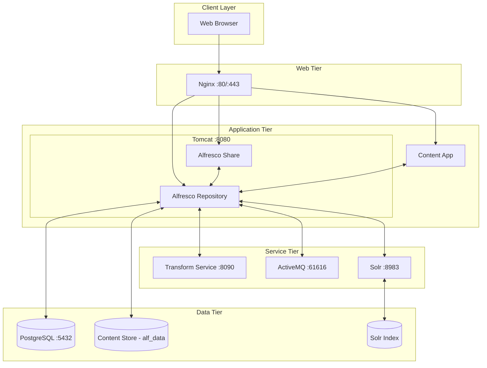
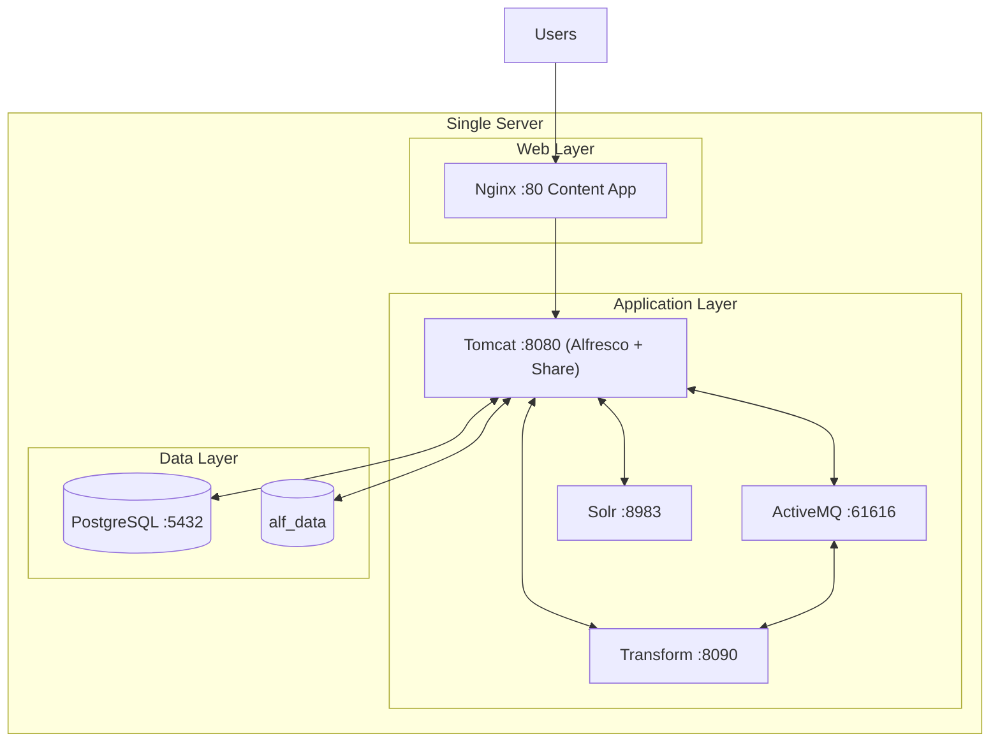
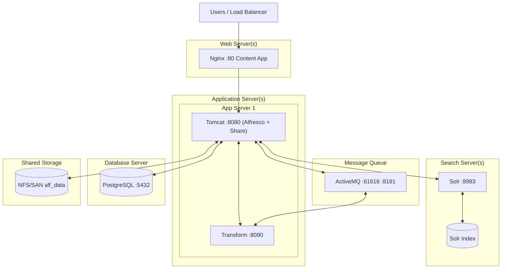
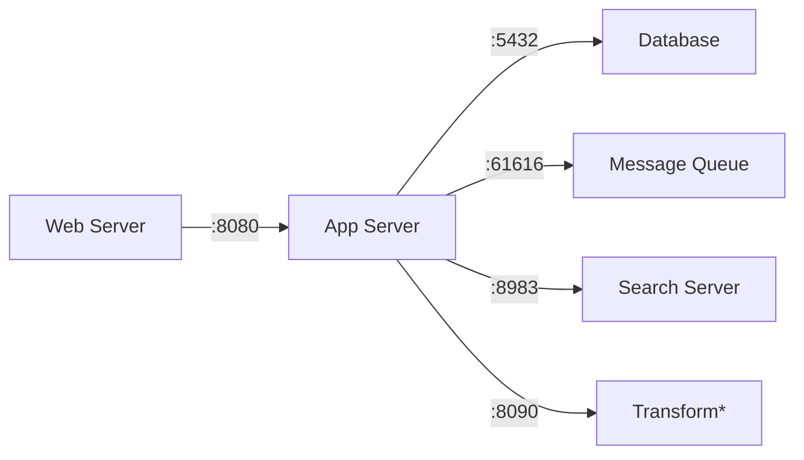
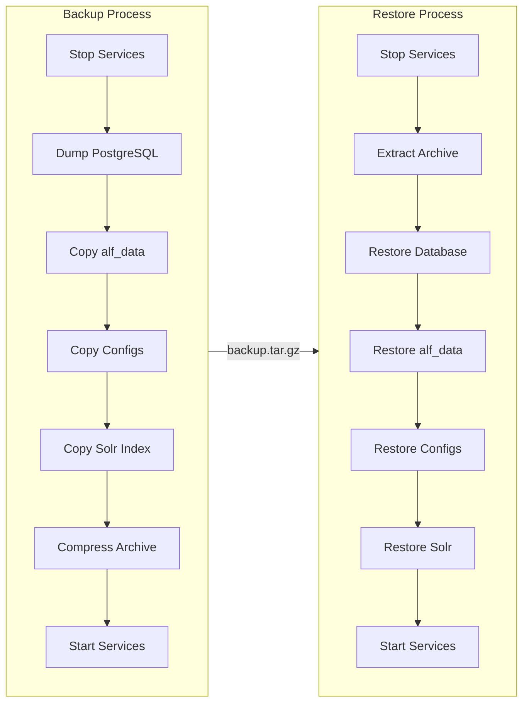

# Alfresco Ubuntu Installer

[](https://github.com/aborroy/alfresco-ubuntu-installer/actions/workflows/ci.yml)

Automated installation scripts for deploying **Alfresco Content Services Community Edition** on Ubuntu using ZIP distribution files.

## Table of Contents

* [Overview](#overview)
* [Deployment Options](#deployment-options)
* [Prerequisites](#prerequisites)
* [Quick Start](#quick-start)
* [Project Structure](#project-structure)
* [Configuration](#configuration)
* [Memory Management](#memory-management)
* [Component Details](#component-details)
* [Service Management](#service-management)
* [Verifying Services](#verifying-services)
* [Troubleshooting](#troubleshooting)
* [Multi-Machine Deployment](#multi-machine-deployment)
* [Backup and Restore](#backup-and-restore)
* [Installing Add-ons](#installing-add-ons)
* [Security Considerations](#security-considerations)

---

## Overview

This project provides a collection of bash scripts to automate the installation and configuration of Alfresco Content Services on Ubuntu 22.04/24.04 LTS.

### Architecture



## Deployment Options

Alfresco Platform supports multiple deployment approaches:

| Method | Best For | Documentation |
|--------|----------|---------------|
| **ZIP Distribution** (this project) | Custom deployments, learning | [Alfresco Docs](https://docs.alfresco.com/content-services/latest/install/zip/) |
| **Ansible** | Multi-server automation | [Ansible Docs](https://docs.alfresco.com/content-services/latest/install/ansible/) |
| **Docker Compose** | Development, small production | [Docker Docs](https://docs.alfresco.com/content-services/latest/install/containers/docker-compose/) |
| **Helm/Kubernetes** | Enterprise production | [Helm Docs](https://docs.alfresco.com/content-services/latest/install/containers/helm/) |

## Prerequisites

### Hardware Requirements

| Deployment | CPU | RAM | Disk |
|------------|-----|-----|------|
| Development | 2+ cores | 8 GB | 20 GB |
| Small Production | 4+ cores | 16 GB | 100 GB |
| Large Production | 8+ cores | 32 GB+ | 500 GB+ |

### Software Requirements

- **Ubuntu** 22.04 LTS or 24.04 LTS (fresh installation recommended)
- **User** with sudo privileges
- **Internet connectivity** for downloading packages

### Network Ports

Ensure these ports are available:

| Port | Service | Description |
|------|---------|-------------|
| 80 | Nginx | HTTP (external access) |
| 443 | Nginx | HTTPS (optional) |
| 5432 | PostgreSQL | Database |
| 8080 | Tomcat | Alfresco/Share (internal) |
| 8090 | Transform | Document transformation |
| 8161 | ActiveMQ | Web console |
| 8983 | Solr | Search service |
| 61616 | ActiveMQ | OpenWire protocol |

## Quick Start

### 1. Clone the Repository

```bash
git clone https://github.com/aborroy/alfresco-ubuntu-installer.git
cd alfresco-ubuntu-installer
```

### 2. Generate Configuration

```bash
bash scripts/00-generate-config.sh
```

This creates `config/alfresco.env` with secure random passwords. Review and customize if needed:

```bash
cat config/alfresco.env
```

### 3. Run Installation Scripts

```bash
# Install all components
bash scripts/01-install_postgres.sh
bash scripts/02-install_java.sh
bash scripts/03-install_tomcat.sh
bash scripts/04-install_activemq.sh
bash scripts/05-download_alfresco_resources.sh
bash scripts/06-install_alfresco.sh
bash scripts/07-install_solr.sh
bash scripts/08-install_transform.sh
bash scripts/09-build_aca.sh
bash scripts/10-install_nginx.sh
```

### 4. Start Services

```bash
bash scripts/11-start_services.sh
```

The script starts all services in the correct order with health checks.

### 5. Access Alfresco

| Application | URL | Default Credentials |
|-------------|-----|---------------------|
| Alfresco Content App | http://localhost/ | admin / admin |
| Alfresco Repository | http://localhost/alfresco/ | admin / admin |
| Alfresco Share | http://localhost/share/ | admin / admin |
| Solr Admin | http://localhost:8983/solr/ | (uses secret header) |
| ActiveMQ Console | http://localhost:8161/ | (see config) |

## Project Structure

```
alfresco-ubuntu-installer/
├── config/
│   ├── alfresco.env.template    # Configuration template
│   ├── alfresco.env             # Your configuration (gitignored)
│   ├── versions.conf            # Active version profile
│   └── profiles/                # Version profiles
│       ├── versions-7.4.conf    # Alfresco 7.4 LTS
│       ├── versions-23.x.conf   # Alfresco 23.x (default)
│       └── versions-25.x.conf   # Alfresco 25.x (latest)
├── scripts/
│   ├── common.sh                # Shared functions
│   ├── 00-generate-config.sh    # Generate secure configuration
│   ├── 01-install_postgres.sh   # PostgreSQL database
│   ├── 02-install_java.sh       # Java JDK
│   ├── 03-install_tomcat.sh     # Apache Tomcat
│   ├── 04-install_activemq.sh   # Apache ActiveMQ
│   ├── 05-download_alfresco_resources.sh  # Download artifacts
│   ├── 06-install_alfresco.sh   # Alfresco + Share
│   ├── 07-install_solr.sh       # Alfresco Search Services
│   ├── 08-install_transform.sh  # Transform Service
│   ├── 09-build_aca.sh          # Alfresco Content App
│   ├── 10-install_nginx.sh      # Nginx reverse proxy
│   ├── 11-start_services.sh     # Start all services
│   ├── 12-stop_services.sh      # Stop all services
│   ├── 13-backup.sh             # Backup Alfresco data
│   ├── 14-restore.sh            # Restore from backup
│   └── 15-install_addons.sh     # Install add-ons (AMPs/JARs)
├── downloads/                   # Downloaded artifacts (gitignored)
├── .github/workflows/
│   └── ci.yml                   # CI/CD pipeline
├── ADDONS.md                    # Add-on installation guide
└── README.md
```

## Configuration

### Version Profiles

The installer supports multiple Alfresco versions through pre-configured profiles:

| Profile | Alfresco | Java | Tomcat | PostgreSQL | Status |
|---------|----------|------|--------|------------|--------|
| **7.4** | 7.4.2 | 17 | 9.0.x | 14 | LTS (legacy) |
| **23.x** | 23.4.1 | 17 | 10.1.x | 16 | Maintained |
| **25.x** | 25.2.0 | 17/21 | 10.1.x | 16 | Stable (newest) |

Select a profile during configuration:

```bash
# List available profiles
bash scripts/00-generate-config.sh --list-profiles

# Use default (23.x)
bash scripts/00-generate-config.sh

# Use Alfresco 7.4 (legacy support)
bash scripts/00-generate-config.sh --profile 7.4

# Use Alfresco 25.x (latest)
bash scripts/00-generate-config.sh --profile 25.x
```

### Version Configuration (`config/versions.conf`)

The active version profile. Default configuration (23.x):

```bash
# Alfresco Components
ALFRESCO_VERSION="23.4.1"
ALFRESCO_SEARCH_VERSION="2.0.14"
ALFRESCO_TRANSFORM_VERSION="5.2.4"

# Infrastructure
POSTGRESQL_VERSION="16"
TOMCAT_VERSION="10.1.48"
ACTIVEMQ_VERSION="5.18.7"
JAVA_VERSION="17"

# Frontend
ACA_VERSION="5.2.0"
NODEJS_VERSION="20"
```

Custom profiles can be created in `config/profiles/` by copying an existing profile.

### Environment Configuration (`config/alfresco.env`)

Generated by `00-generate-config.sh` with secure random passwords:

```bash
# Database
ALFRESCO_DB_HOST="localhost"
ALFRESCO_DB_PORT="5432"
ALFRESCO_DB_NAME="alfresco"
ALFRESCO_DB_USER="alfresco"
ALFRESCO_DB_PASSWORD="<auto-generated>"

# Solr
SOLR_HOST="localhost"
SOLR_PORT="8983"
SOLR_SHARED_SECRET="<auto-generated>"

# And more...
```

## Memory Management

### Automatic Memory Allocation

The installer automatically detects system RAM and applies optimal memory settings for all components. This ensures Alfresco runs efficiently without manual tuning.

#### Memory Profiles

| Profile | System RAM | Tomcat/Alfresco | Solr | Transform | ActiveMQ | PostgreSQL |
|---------|------------|-----------------|------|-----------|----------|------------|
| **minimal** | < 8 GB | 1-2 GB | 512 MB | 512 MB | 256 MB | 256 MB shared |
| **small** | 8-16 GB | 2-3 GB | 1 GB | 768 MB | 512 MB | 512 MB shared |
| **medium** | 16-32 GB | 4-6 GB | 2 GB | 1 GB | 512 MB | 1 GB shared |
| **large** | 32-64 GB | 8-12 GB | 4 GB | 2 GB | 1 GB | 2 GB shared |
| **xlarge** | 64+ GB | 16-24 GB | 8 GB | 4 GB | 2 GB | 4 GB shared |

> **Recommendation**: 16 GB RAM minimum for production workloads (medium profile).

#### PostgreSQL Tuning

The installer automatically configures these PostgreSQL parameters based on available RAM:

| Parameter | Description | Example (16GB) |
|-----------|-------------|----------------|
| `shared_buffers` | Memory for caching data | 1024 MB |
| `effective_cache_size` | Planner's assumption of available cache | 2048 MB |
| `work_mem` | Memory per sort/hash operation | 64 MB |
| `maintenance_work_mem` | Memory for maintenance operations | 256 MB |
| `wal_buffers` | Memory for WAL data | 16 MB |
| `checkpoint_completion_target` | WAL checkpoint spread | 0.9 |

#### JVM Settings

Each Java-based service receives optimized JVM settings:

**Tomcat/Alfresco** (medium profile):
```
-Xms4096m -Xmx6144m -XX:+UseG1GC -XX:+UseStringDeduplication -XX:MaxGCPauseMillis=200
```

**Solr** (medium profile):
```
-Xms2048m -Xmx2048m
```

**Transform Service** (medium profile):
```
-Xms512m -Xmx1024m -XX:+UseG1GC
```

**ActiveMQ** (medium profile):
```
-Xms512m -Xmx512m
```

### Manual Memory Override

To override automatic detection, uncomment and modify these lines in `config/alfresco.env`:

```bash
# Memory overrides (values in MB)
export TOMCAT_XMS_MB="4096"               # Tomcat initial heap
export TOMCAT_XMX_MB="6144"               # Tomcat maximum heap
export SOLR_HEAP_MB="2048"                # Solr heap
export TRANSFORM_HEAP_MB="1024"           # Transform service heap
export ACTIVEMQ_HEAP_MB="512"             # ActiveMQ heap
export POSTGRES_SHARED_BUFFERS_MB="1024"  # PostgreSQL shared_buffers
export POSTGRES_EFFECTIVE_CACHE_MB="2048" # PostgreSQL effective_cache_size
```

### Viewing Current Allocation

The start script displays the active memory profile:

```bash
$ bash scripts/11-start_services.sh

[INFO] Detected system memory: 16384MB
[INFO] Applying 'medium' memory profile (16-32GB)
[INFO] Memory allocation (medium profile):
[INFO]   Tomcat/Alfresco: 4096MB - 6144MB
[INFO]   Solr:            2048MB
[INFO]   Transform:       1024MB
[INFO]   ActiveMQ:        512MB
[INFO]   PostgreSQL:      shared_buffers=1024MB, effective_cache=2048MB
```

## Component Details

### 1. PostgreSQL

- **Version**: 16
- **Port**: 5432
- **Data**: `/var/lib/postgresql/16`
- **Logs**: `/var/log/postgresql`

### 2. Java JDK

- **Version**: 17 (OpenJDK)
- **JAVA_HOME**: `/usr/lib/jvm/java-17-openjdk-amd64`
- **Architecture**: Auto-detected (amd64/arm64)

### 3. Apache Tomcat

- **Version**: 10.1.48
- **Home**: `/home/ubuntu/tomcat`
- **Logs**: `/home/ubuntu/tomcat/logs`
- **Memory**: Configurable via `TOMCAT_XMS`/`TOMCAT_XMX`

### 4. Apache ActiveMQ

- **Version**: 5.18.7
- **Home**: `/home/ubuntu/activemq`
- **OpenWire Port**: 61616
- **Web Console**: 8161

### 5. Alfresco Content Services

- **Version**: 23.4.1 Community
- **Context**: `/alfresco`
- **Data**: `/home/ubuntu/alf_data`
- **Config**: `/home/ubuntu/tomcat/shared/classes/alfresco-global.properties`

### 6. Alfresco Share

- **Context**: `/share`
- **Logs**: `/home/ubuntu/tomcat/logs/share.log`

### 7. Alfresco Search Services (Solr)

- **Version**: 2.0.14
- **Home**: `/home/ubuntu/alfresco-search-services`
- **Port**: 8983
- **Authentication**: Shared secret

### 8. Transform Service

- **Version**: 5.2.4 (All-In-One)
- **Home**: `/home/ubuntu/transform`
- **Port**: 8090
- **Dependencies**: ImageMagick, LibreOffice, ExifTool
- **Logs**: `journalctl -u transform.service -o cat --no-pager` 

### 9. Alfresco Content App

- **Version**: 5.2.0
- **Source**: `/home/ubuntu/alfresco-content-app`
- **Build Output**: `/home/ubuntu/alfresco-content-app/dist/content-ce`

### 10. Nginx

- **Port**: 80
- **Config**: `/etc/nginx/sites-available/alfresco`
- **Web Root**: `/var/www/alfresco-content-app`
- **Logs**: `/var/log/nginx/alfresco_*.log`

## Service Management

### Service Lifecycle

**Startup Order:**


**Shutdown Order (reverse):**


### Start All Services

```bash
bash scripts/11-start_services.sh
```

Options:
- `--no-wait` - Start services without waiting for health checks

### Stop All Services

```bash
bash scripts/12-stop_services.sh
```

The stop script shuts down services in the correct order (reverse of startup) to ensure data integrity:

1. **Nginx** - Stops accepting new connections
2. **Solr** - Commits pending index changes
3. **Tomcat** - Allows in-flight requests to complete
4. **Transform** - Stops document transformation
5. **ActiveMQ** - Drains pending messages
6. **PostgreSQL** - Stops last to ensure all data is persisted

Options:
- `--force` - Force kill services that don't stop gracefully (uses SIGKILL)
- `--no-wait` - Stop services without waiting for graceful shutdown

Example output:
```bash
$ bash scripts/12-stop_services.sh

[STEP] Stopping Alfresco services...
[STEP] Stopping Nginx...
[INFO] Nginx stopped successfully
[STEP] Stopping Solr...
[INFO] Solr will flush pending changes...
[INFO] Solr stopped successfully
...

┌─────────────────────────────────────────────────────────────┐
│                    SERVICE STATUS                           │
├────────────────────┬────────────────────────────────────────┤
│ Nginx              │ v stopped                              │
│ Solr               │ v stopped                              │
│ Tomcat (Alfresco)  │ v stopped                              │
│ Transform Service  │ v stopped                              │
│ ActiveMQ           │ v stopped                              │
│ PostgreSQL         │ v stopped                              │
└────────────────────┴────────────────────────────────────────┘

[INFO] All services stopped successfully!
```

### Start Individual Services

```bash
sudo systemctl start postgresql
sudo systemctl start activemq
sudo systemctl start transform
sudo systemctl start tomcat
sudo systemctl start solr
sudo systemctl start nginx
```

### Stop Individual Services

```bash
# Stop in reverse order for safety
sudo systemctl stop nginx
sudo systemctl stop solr
sudo systemctl stop tomcat
sudo systemctl stop transform
sudo systemctl stop activemq
sudo systemctl stop postgresql
```

### Check Service Status

```bash
sudo systemctl status postgresql activemq transform tomcat solr nginx
```

### View Logs

```bash
# Alfresco logs
tail -f /home/ubuntu/tomcat/logs/catalina.out
tail -f /home/ubuntu/tomcat/logs/alfresco.log

# Solr logs
tail -f /home/ubuntu/alfresco-search-services/logs/solr.log

# Nginx logs
tail -f /var/log/nginx/alfresco_access.log
tail -f /var/log/nginx/alfresco_error.log

# Transform logs
journalctl -u transform.service -o cat --no-pager
```

## Verifying Services

After installation, verify each component is working correctly through browser-based tests.

### Verification Checklist

| Service | Test | Expected Result |
|---------|------|-----------------|
| PostgreSQL | Query database tables | Alfresco schema exists |
| Repository | Login to Share/ACA | Dashboard loads successfully |
| Transform | Upload Office document | PDF preview renders |
| Solr | Search for content | Results appear within seconds |
| ActiveMQ | Check queue activity | Messages processed without errors |

### 1. PostgreSQL Database

PostgreSQL stores all Alfresco metadata, user information, and content references.

Verify the database is accessible and contains Alfresco tables.

```bash
source config/alfresco.env
PGPASSWORD="${ALFRESCO_DB_PASSWORD}" psql -h localhost -U alfresco -d alfresco -c "\dt alf_*"
```

Success indicators

- Command returns a list of tables starting with `alf_` (e.g., `alf_node`, `alf_content_url`, `alf_transaction`)
- No connection errors occur

Check node count to verify Alfresco is storing content:

```bash
source config/alfresco.env
PGPASSWORD="${ALFRESCO_DB_PASSWORD}" psql -h localhost -U alfresco -d alfresco -c "SELECT COUNT(*) FROM alf_node;"
```

*A fresh installation typically shows several thousand nodes (system content and default users)*

### 2. Repository and Authentication

Access Alfresco Share or Content App and login.

1. Open http://localhost/share/ or http://localhost/
2. Login with `admin` / `admin`
3. Verify the dashboard loads without errors

Success indicators

- User dashboard displays correctly
- No connection errors in the browser console
- Navigation between pages works smoothly

### 3. Transform Service

The Transform Service converts documents to different formats, enabling PDF previews and thumbnails.

Upload an Office document and verify PDF preview generation.

1. Login to Share (http://localhost/share/)
2. Navigate to a folder (e.g., `Shared Files`)
3. Upload a `.docx`, `.xlsx`, or `.pptx` file
4. Click on the uploaded document
5. Wait a few seconds for the preview to generate

Success indicators

- PDF preview renders in the document viewer
- Thumbnail appears in the document library
- No transformation error messages appear

If preview fails, check Transform Service logs:
```bash
journalctl -u transform.service -o cat --no-pager | tail -50
```

### 4. Search Service (Solr)

Create content and verify search returns results.

1. Login to Share or ACA
2. Create a new text file with unique content (e.g., "UniqueTestPhrase12345")
3. Wait 30-60 seconds for indexing to complete
4. Use the search box to search for your unique phrase
5. Verify the document appears in search results

Success indicators

- Search results include your newly created document
- Search suggestions appear as you type
- Advanced search filters work correctly

Check indexing status via Solr Admin

1. Open http://localhost:8983/solr/ (requires shared secret header and an extension like [FlexHeaders](https://addons.mozilla.org/en-US/firefox/addon/flexheaders-alter-http-headers) for Firefox)
2. Or use curl:
   ```bash
   source config/alfresco.env
   curl -H "X-Alfresco-Search-Secret: ${SOLR_SHARED_SECRET}" \
        "http://localhost:8983/solr/alfresco/admin/ping"
   ```

Expected response: `{"status":"OK"}`

### 5. ActiveMQ Message Broker

Verify message queues are active and processing.

1. Open http://localhost:8161/
2. Login with credentials from `config/alfresco.env`:
   ```bash
   source config/alfresco.env
   echo "User: ${ACTIVEMQ_ADMIN_USER}"
   echo "Password: ${ACTIVEMQ_ADMIN_PASSWORD}"
   ```
3. Click "Manage ActiveMQ broker"
4. Navigate to "Queues" tab
5. Look for Alfresco-related queues (e.g., `alfresco.transform.request`)

Success indicators

- Queues are listed and active
- "Messages Enqueued" counter increases when uploading documents
- "Messages Dequeued" counter shows messages are being processed
- No messages stuck in "Pending" state for extended periods

## Troubleshooting

### Alfresco Won't Start

1. **Check Tomcat logs**:
   ```bash
   tail -100 /home/ubuntu/tomcat/logs/catalina.out
   ```

2. **Verify database connection**:
   ```bash
   source config/alfresco.env
   PGPASSWORD="${ALFRESCO_DB_PASSWORD}" psql -h localhost -U alfresco -d alfresco -c "SELECT 1"
   ```

3. **Check memory**:
   ```bash
   free -h
   ```

### Solr Not Indexing

1. **Check Solr is running**:
   ```bash
   source config/alfresco.env
   curl -H "X-Alfresco-Search-Secret: ${SOLR_SHARED_SECRET}" \
   http://localhost:8983/solr/alfresco/admin/ping
   ```

2. **Verify shared secret matches** in both:
   - `/home/ubuntu/tomcat/shared/classes/alfresco-global.properties`
   - `/home/ubuntu/alfresco-search-services/solrhome/conf/shared.properties`

### Transform Service Errors

1. **Check health endpoint**:
   ```bash
   curl http://localhost:8090/actuator/health
   ```

2. **Verify LibreOffice is installed**:
   ```bash
   soffice --version
   ```

### ActiveMQ Errors

1. **Verify if ActiveMQ is running**

   ```bash
   source config/alfresco.env
   curl -u "${ACTIVEMQ_ADMIN_USER}:${ACTIVEMQ_ADMIN_PASSWORD}" \
   http://localhost:8161/admin/
   ```

### Port Conflicts

If you need to change ports, update:

1. `config/alfresco.env` - Update the port variables
2. Re-run the relevant installation script
3. Restart services

## Multi-Machine Deployment

For production deployments across multiple machines, you can distribute components for better scalability and resilience.

### Single Server Architecture

All components on one machine (development/small production):



**Scripts to run:** All scripts (01-11) on the single server.

### Multi-Server Architecture

Distributed deployment for production (high availability):



### Scripts by Server Role

| Server Role | Scripts to Run | Configuration |
|-------------|----------------|---------------|
| **Database** | `01-install_postgres.sh` | Allow remote connections in pg_hba.conf |
| **Application** | `02-06`, `08` | Set `ALFRESCO_DB_HOST`, `ACTIVEMQ_HOST`, `SOLR_HOST` |
| **Search** | `02`, `07` | Set `ALFRESCO_HOST` for tracking |
| **Message Queue** | `02`, `04` | Configure network binding |
| **Web/Frontend** | `02`, `09`, `10` | Configure upstream servers in Nginx |

### Configuration Steps

1. **Edit `config/alfresco.env`** to set correct hostnames:
   ```bash
   ALFRESCO_DB_HOST="db.example.com"
   SOLR_HOST="search.example.com"
   ACTIVEMQ_HOST="mq.example.com"
   ```

2. **Run only relevant scripts** on each machine:
   - Database server: `01-install_postgres.sh`
   - Application server: `02-06` and `08`
   - Search server: `02` and `07`
   - Web server: `09-10`

3. **Ensure network connectivity** between machines on required ports.

### Network Requirements



*Transform service typically runs on the App Server but can be separated.

## Backup and Restore

### Backup and Restore Flow



### Creating Backups

The backup script creates complete or partial backups of your Alfresco installation:

```bash
# Full backup (recommended - stop services first)
bash scripts/12-stop_services.sh
bash scripts/13-backup.sh
bash scripts/11-start_services.sh

# Full backup with services running (hot backup)
bash scripts/13-backup.sh --hot
```

#### Backup Types

| Type | Command | Contents |
|------|---------|----------|
| **full** | `--type full` | Database + Content + Config + Solr (default) |
| **db** | `--type db` | PostgreSQL database only |
| **content** | `--type content` | Content store (alf_data) only |
| **config** | `--type config` | Configuration files only |
| **solr** | `--type solr` | Solr indexes only |

#### Backup Options

```bash
# Database-only backup
bash scripts/13-backup.sh --type db

# Custom output location
bash scripts/13-backup.sh --output /mnt/backup

# Skip Solr indexes (faster, indexes can be rebuilt)
bash scripts/13-backup.sh --no-solr

# Keep backups for 7 days only
bash scripts/13-backup.sh --keep 7

# Uncompressed backup
bash scripts/13-backup.sh --no-compress

# Custom backup name
bash scripts/13-backup.sh --name weekly-backup
```

#### Backup Contents

A full backup includes:

| Component | Location | Description |
|-----------|----------|-------------|
| Database | `database_alfresco.sql` | PostgreSQL dump (plain + custom format) |
| Content Store | `alf_data/` | All documents and content |
| Configuration | `config/` | alfresco-global.properties, server.xml, systemd units |
| Solr Indexes | `solr/` | Search indexes (optional, can be rebuilt) |
| Manifest | `manifest.txt` | Backup metadata and checksums |

#### Backup Best Practices

1. **Stop services** before backup for consistency (cold backup)
2. **Skip Solr** with `--no-solr` for faster backups (indexes rebuild automatically)
3. **Schedule regular backups** via cron:
   ```bash
   # Daily backup at 2 AM, keep 7 days
   0 2 * * * /path/to/scripts/12-stop_services.sh && /path/to/scripts/13-backup.sh --keep 7 && /path/to/scripts/11-start_services.sh
   ```
4. **Store backups off-site** for disaster recovery
5. **Test restores regularly** to verify backup integrity

### Restoring Backups

The restore script recovers your Alfresco installation from a backup:

```bash
# Full restore (services will be stopped automatically)
bash scripts/14-restore.sh --backup /home/ubuntu/backups/alfresco-backup_20240115.tar.gz

# Restore with automatic confirmation
bash scripts/14-restore.sh --backup backup.tar.gz --force

# Preview restore without making changes
bash scripts/14-restore.sh --backup backup.tar.gz --dry-run
```

#### Restore Types

| Type | Command | Restores |
|------|---------|----------|
| **full** | `--type full` | Database + Content + Config + Solr (default) |
| **db** | `--type db` | PostgreSQL database only |
| **content** | `--type content` | Content store (alf_data) only |
| **config** | `--type config` | Configuration files only |
| **solr** | `--type solr` | Solr indexes only |

#### Restore Options

```bash
# Database-only restore
bash scripts/14-restore.sh --backup backup.tar.gz --type db

# Skip Solr restore (indexes rebuild automatically)
bash scripts/14-restore.sh --backup backup.tar.gz --no-solr

# Force restore without prompts
bash scripts/14-restore.sh --backup backup.tar.gz --force

# Dry run to preview changes
bash scripts/14-restore.sh --backup backup.tar.gz --dry-run
```

#### Restore Process

1. **Validation** - Verifies backup integrity and contents
2. **Service Stop** - Stops running services (prompts for confirmation)
3. **Database** - Drops and recreates database, restores from dump
4. **Content** - Moves existing alf_data aside, restores from backup
5. **Configuration** - Restores config files (keeps .restore-backup copies)
6. **Solr** - Restores indexes or lets them rebuild
7. **Verification** - Displays summary and next steps

#### Post-Restore Steps

```bash
# Start services after restore
bash scripts/11-start_services.sh

# Verify Alfresco is accessible
curl http://localhost/alfresco/api/-default-/public/alfresco/versions/1/probes/-ready-
```

## Installing Add-ons

Alfresco supports extensions through AMP (Alfresco Module Package) and JAR modules. Use the `15-install_addons.sh` script to install add-ons after the base installation is complete.

### Quick Examples

```bash
# Stop services before installing add-ons
bash scripts/12-stop_services.sh

# Install an AMP add-on (e.g., OOTBee Support Tools from Maven Central)
bash scripts/15-install_addons.sh \
    --url https://repo1.maven.org/maven2/org/orderofthebee/support-tools/support-tools-repo/1.2.3.0/support-tools-repo-1.2.3.0-amp.amp \
    --target repo

# Install a JAR add-on (e.g., Script Root Object from GitHub)
bash scripts/15-install_addons.sh \
    --url https://github.com/aborroy/alfresco-script-root-object/releases/download/2.0.0/alfresco-script-root-object-2.0.0.jar \
    --target repo

# List installed add-ons
bash scripts/15-install_addons.sh --list

# Start services
bash scripts/11-start_services.sh
```

### Add-on Types

| Type | Target | Installation Path |
|------|--------|-------------------|
| **AMP** (platform) | `--target repo` | Applied to `alfresco.war` via MMT |
| **AMP** (Share) | `--target share` | Applied to `share.war` via MMT |
| **JAR** (platform) | `--target repo` | `${ALFRESCO_HOME}/modules/platform/` |
| **JAR** (Share) | `--target share` | `${ALFRESCO_HOME}/modules/share/` |

For detailed instructions, examples, and troubleshooting, see **[ADDONS.md](ADDONS.md)**.

## Security Considerations

1. **Change default admin password** after first login
2. **Configure HTTPS** in Nginx for production
3. **Restrict network access** to internal ports (8080, 8983, etc.)
4. **Keep `config/alfresco.env` secure** - it contains passwords
5. **Regular backups**